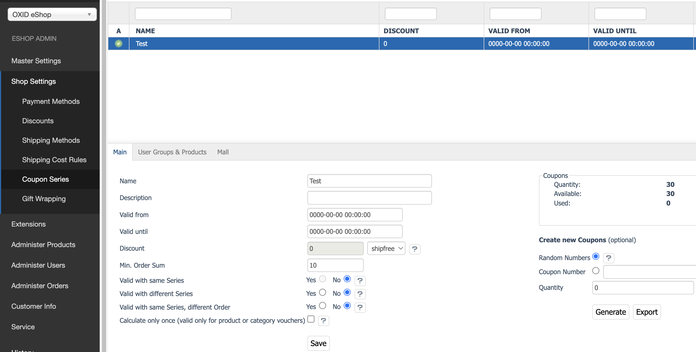

# OXID Free Shipping Coupons Module

[](https://github.com/OXID-eSales/freeshipping-coupons-module/actions/workflows/trigger.yaml)
[](https://packagist.org/packages/oxid-esales/freeshipping-coupons-module)
[](https://github.com/oxid-esales/freeshipping-coupons-module)

[](https://sonarcloud.io/dashboard?id=OXID-eSales_freeshipping-coupons-module)
[](https://sonarcloud.io/dashboard?id=OXID-eSales_freeshipping-coupons-module)
[](https://sonarcloud.io/dashboard?id=OXID-eSales_freeshipping-coupons-module)

This module introduces a new coupon type, ``shipfree``, designed to balance shipping costs to zero for eligible orders. When applied, this coupon calculates its value based on the current basket’s shipping cost, effectively covering all shipping fees for the user.

## Branch compatibility

* 1.1.x versions (or b-7.3.x branch) are compatible with OXID eShop compilation b-7.3.x
* 1.0.x versions (or b-7.2.x branch) are compatible with OXID eShop compilation b-7.2.x

# Development installation on OXID eShop SDK

The installation instructions below are shown for the current [SDK](https://github.com/OXID-eSales/docker-eshop-sdk)
for shop 7.3. Make sure your system meets the requirements of the SDK.

0. Ensure all docker containers are down to avoid port conflicts

1. Clone the SDK for the new project
```shell
echo MyProject && git clone https://github.com/OXID-eSales/docker-eshop-sdk.git $_ && cd $_
```

2. Clone the repository to the source directory
```shell
git clone --recurse-submodules https://github.com/OXID-eSales/freeshipping-coupons-module.git --branch=b-7.3.x ./source
```

3. Run the recipe to setup the development environment
```shell
./source/recipes/setup-development.sh
```

You should be able to access the shop with http://localhost.local and the admin panel with http://localhost.local/admin
(credentials: noreply@oxid-esales.com / admin)

### Usage

#### Configuration:

- Navigate to Shop Settings → Coupon Series → Main.
- Under Discount, select the ``shipfree`` to enable shipping cost compensation on orders.
- Configure the remaining coupon settings as desired.
  


#### Usage Notes:
- Zero-value vouchers appear in the cart to ensure ``shipfree`` coupons are calculated during checkout.
- If no delivery fees apply, users will see the error, “The voucher might be wasted if not applied to an order with delivery fees.”

#### Testing & Limitations:
- Ensure that shipping settings are configured.
- Only one ``shipfree`` coupon is allowed per basket.

### Order confirmation emails

In order to properly display the free shipping voucher value in order confirmation email, you need to change the templates 
named ``order_cust.html.twig`` and ``order_owner.html.twig`` to display the free shipping coupons value and shown in the example below.

```bash
    
        
        <tr valign="top" bgcolor="#ebebeb">
            <td align="right" colspan="{{ iFooterColspan }}" class="odd text-right">{{ voucher.oxvouchers__oxvouchernr.value }}</td>
            <td align="right" class="odd text-right">
                
                  {{ format_price(voucherseries.oxvoucherseries__oxdiscount.value , { currency: currency }) }}
                
                  {{ voucherseries.oxvoucherseries__oxdiscount.value }}%
                
                  {{ format_price(voucher.oxvouchers__oxdiscount.value , { currency: currency }) }}
                
            </td>
        </tr>
    
```bash


## Testing
### Linting, syntax check, static analysis

```bash
$ composer update
$ composer static
```

### Unit/Integration/Acceptance tests

- Install this module in a running OXID eShop
- Reset the shop's database

```bash
bin/oe-console oe:database:reset --db-host=db-host --db-port=db-port --db-name=db-name --db-user=db-user --db-password=db-password --force
```

- Run all the tests

```bash
composer tests-all
```

- Or the desired suite

```bash
composer tests-unit
composer tests-integration
composer tests-codeception
```
